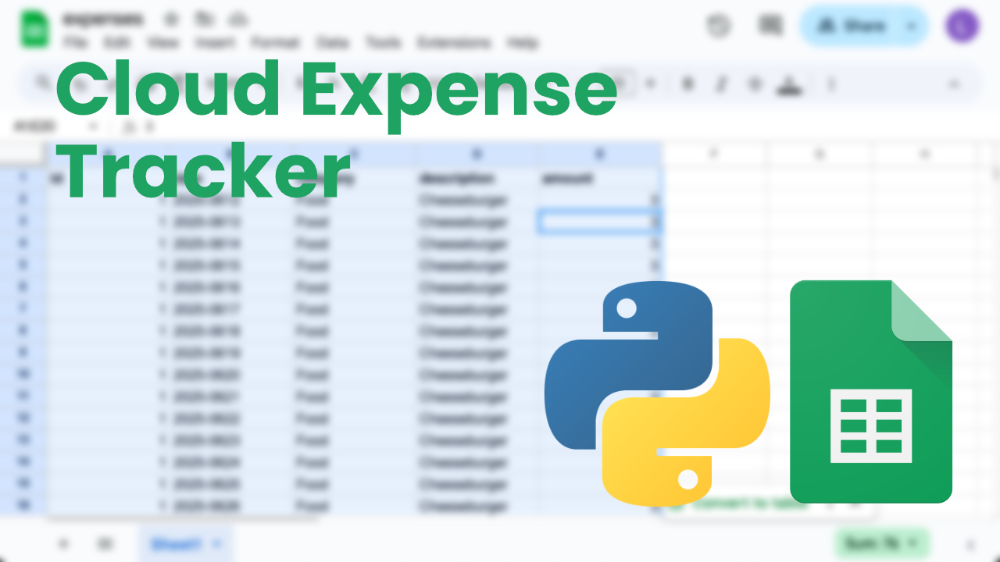
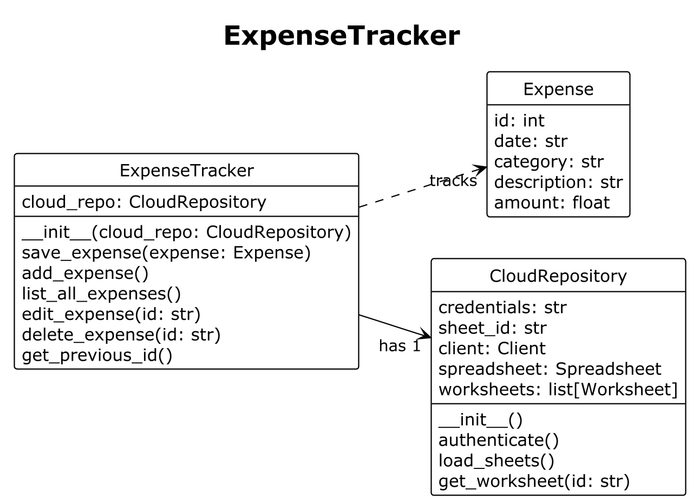

# Google Spreadsheet Cloud Expense Tracker



## About

This project is about a Python CLI application that uses the [gspread is a Python API for Google Sheets](https://docs.gspread.org/en/latest/index.html) package to connect to the Google Spreadsheets API to log expenses in a spreadsheet. The app supports all four CRUD operations – adding a new expense, listing all expenses, editing an expense and deleting an expense.

## Motivation

-   Experiment with the Google Sheets API and gspread
-   Learn how to use Python to write data to cloud-based files
-   Transition from storing expenses in a local CSV file to managing them remotely

## Class Diagram

As a beginner developer and I didn't follow a top-down architecture approach for this project. I jumped straight into code and started building. Why? Because I got excited and since my projects are not yet huge in scope, getting started early is important to me. If I don't, I risk starting to overthink, procrastinate or even drop the project alltogether.



## CSV Version

My initial goal was to build an app that could read and write expenses to a local `.csv` file. It was only during later  development stages that I started experimenting with storing expenses in a cloud-based spreadsheet.

In this section, I’d like to outline some of the challenges I encountered while implementing the four CRUD operations for the csv version.

The local `.csv` file acts as the project’s "database" and resides at the root of the project directory. It contains a header row with four comma-separated columns.

```csv
date,category,description,amount
```

One of the first steps I took was to create this huge method to add a new expense. The user input is stored in a dictionary as key-value pairs and then the file is opened and the values are stored as a new row using the `DictWriter` class from the `csv` package.

```python
def add_expense():
    date = datetime.date.today().isoformat()
    category = input("What expense category do you wish to add? ")
    description = input("What expense do you wish to add? ")

    while True:
        try:
            amount = float(input("What amount do you wish to add? "))
            break
        except ValueError:
            print("Please enter a valid number for amount.")

    expense = {
        "date": date,
        "category": category,
        "description": description,
        "amount": amount
    }

    filename = "expenses.csv"
    file_exists = os.path.isfile(filename)

    with open(filename, "a", encoding="utf-8", newline="") as csvfile:
        fieldnames = ["date", "category", "description", "amount"]
        writer = DictWriter(csvfile, fieldnames=fieldnames)
        if not file_exists or os.path.getsize(filename) == 0:
            writer.writeheader()
        writer.writerow(expense)
```

Getting all the expense records was straightforward too. I used `DictReader` to get each row as a dictionary and print it.

```python
def get_expenses():
    with open("expenses.csv", "r", encoding="utf-8", newline="") as csvfile:
        reader = csv.DictReader(csvfile)
        for row in reader:
            print(row)
```

However, once I tried to implement the update and delete methods I was stuck for a while. I realized that if I want to edit a row that there's no way of getting a specific record which meant that my database was missing an important field – an id field to uniquely identify each record.

I implemented a new field to the header.

```csv
id,date,category,description,amount
```

Unfortunately, this only solved half the problem. The other problem was that in a simple `csv` file there isn't really any random access possible. You can't edit a specific row, because you can't select a row. Whenever there is a change, the entire file needs to be re-written. This same logic also applies to deleting a record.

In order to solve this problem I created a `load_expenses()` method that loads the current records and stores them in memory to a list. I also implemented a class called `Expense` which stores all the records as `Expense` objects in that list.

The method gets called once when the application starts.

```python
@dataclass
class Expense:
    id: int
    date: str
    category: str
    description: str
    amount: float

def load_expenses(self):
    with open(self.filepath, "r", encoding="utf-8", newline="") as csvfile:
        reader = DictReader(csvfile, delimiter=',')
        for expense in reader:
            expense_obj = Expense(
                int(expense["id"]),
                expense["date"],
                expense["category"],
                expense["description"],
                float(expense["amount"])
            )
            self.expenses.append(expense_obj)
```

But this method wouldn't make sense without the `save_expenses()` method. Each time a new expense is added, edited or removed, this method gets called and all the `Expense` objects in the list have to be written to the csv file again.

```python
def save_expenses(self):
    fieldnames = ["id", "date", "category", "description", "amount"]
    with open(self.filepath, "w", encoding="utf-8", newline="") as csvfile:
        writer = DictWriter(csvfile, fieldnames=fieldnames)
        writer.writeheader()
        for expense in self.expenses:
            writer.writerow(expense.__dict__)
```

The `expense.__dict__` transforms the attributes of each `Expense` object into a key-value dictionary that can be used by the `DictWriter` to write to the csv file.

The problem with the CSV version is that it's an expensive operation to rewrite the entire file each time a new expense is added, edited or removed. The larger the data set gets the more this will become a problem.

## Google Spreadsheet Version

I've once read somewhere that you can use Python to automate Excel and I looked it up and came accross a video about how to use the `gspread` module to write to a Google Spreadsheet.

The idea that my CLI app can write data directly to a file in the cloud sounded really awesome and so I wanted to try it out.

### API Access and Service Account

I used the [official gspread Authentication documentation](https://docs.gspread.org/en/latest/oauth2.html) to enable the Google Drive API and Google Sheets API as well as create a service account to share the spreadsheet with.

### CloudRepository

I thought about how to rebuild the project and move from the CSV version to the cloud version. The first thing I did was to create a new class called `CloudRepository` which acts as the gateway for my `ExpenseTracker` to connect to the spreadsheet.

The most important method is to to authenticate to the Google Sheets API with credentials stored in the `service_account.json`.

After successful authentication, objects of the class `Spreadsheet` and `Worksheet` are loaded from Google and stored as references in the repository.

```python
class CloudRepository:

    def __init__(self):
        load_dotenv()
        self.credentials = os.getenv("GOOGLE_SHEETS_CREDENTIALS")
        self.sheet_id = os.getenv("SPREADSHEET_ID")
        self.client = None
        self.spreadsheet = None
        self.worksheets = []

    def authenticate(self):
        try:
            self.client = gspread.service_account(filename=self.credentials)
        except RefreshError:
            raise RefreshError("Can't connect to Google Sheets API due to wrong credentials")

    def load_sheets(self):
        try:
            self.spreadsheet = self.client.open_by_key(self.sheet_id)
            self.worksheets = self.spreadsheet.worksheets()
        except SpreadsheetNotFound:
            raise SpreadsheetNotFound(f"Spreadsheet with the id {self.sheet_id} not found")

    def get_worksheet(self, id):
        for worksheet in self.worksheets:
            if id == self.worksheets.index(worksheet):
                return self.worksheets[id]
        raise WorksheetNotFound("Worksheet not found.")
```

### Expense Tracker

Although the core logic of the `ExpenseTracker` class stayed the same, the CSV reading and writing part needed to be swapped by the cloud repo.

This example shows how an expense is edited. Each record in the spreadsheet is looped over starting at row number two. If the record's id is equal to the id the user wants to edit, new user input data is requested.

`worksheet.update([[category, description, amount]], f'C{idx}:E{idx}')` updates the fields in the columns C through E with the new data for the selected row.

```python
def edit_expense(self, id):
    worksheet = self.cloud_repo.get_worksheet(0)
    records = worksheet.get_all_records()
    for idx, record in enumerate(records, start=2):
        if record["id"] == id:
            category = input("What expense category do you wish to edit? ")
            description = input("What expense do you wish to edit? ")
            while True:
                try:
                    amount = float(input("What amount do you wish to add? "))
                    break
                except ValueError:
                    print("Please enter a valid number for amount.")
            worksheet.update([[category, description, amount]], f'C{idx}:E{idx}')
            break
    print(f"An expense with id {id} was not found.")
```

## Learnings

This has been a every exciting project that taught me a lot about in-memory data manipulation as well has how to write data to a file in the cloud through an API. The toughest part was to document all of this and try to convey my thought processes while building the app.

## Resources

-   [CSV File Reading and Writing](https://docs.python.org/3/library/csv.html)
-   [Python API for Google Sheets](https://docs.gspread.org/en/latest/)
-   [IBM UML dependency relationship](https://www.ibm.com/docs/en/dmrt/9.5.0?topic=diagrams-dependency-relationships)
-   [IBM Uni-directional association](https://developer.ibm.com/articles/the-class-diagram/)
